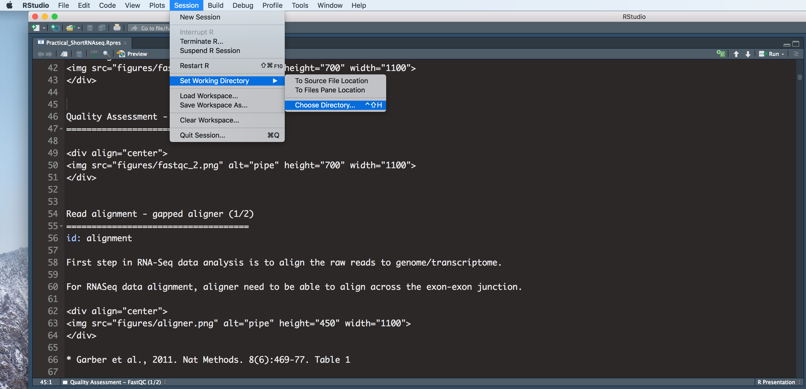
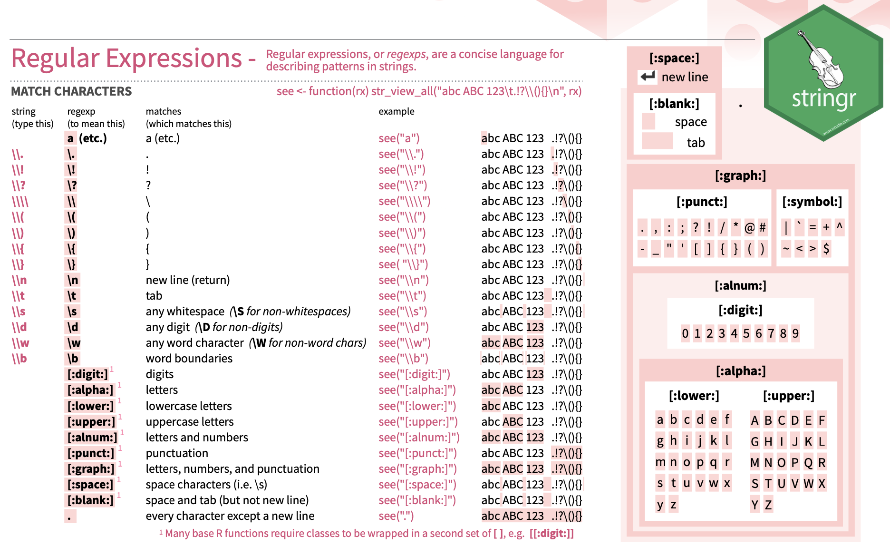

```{r setup, include=FALSE}
#knitr::opts_chunk$set(echo = TRUE)

# knitr::opts_chunk$set(cache = TRUE, warning = FALSE, echo=T,
#                       message = FALSE, cache.lazy = FALSE)

```

# Introduction

In this section, we will recap one of the most import data structures. We will also cover the basic idea of `regular expressions`, which is a very useful tool for describing patterns in strings.

The purpose of this recap course is to show how to work with a real dataset in R. 

The course is intended to be self-contained, but if you are new to R, we recommend that you go through our previous introduction to R:

[[https://lmsbioinformatics.github.io/LMS_Reproducible-R/]]


# Materials

* All prerequisites, links to material and slides for this course can be found on github - [LMS_Recap4R](https://lmsbioinformatics.github.io/LMS_Recap4R/)

* Or can be downloaded as a zip archive from here - [Download zip](https://github.com/LMSBioinformatics/LMS_Recap4R/archive/master.zip)

# Set the Working directory

Before running any of the code in the practicals or slides we need to set the working directory to the folder we unarchived. 

## Set working directory - in Rstudio

You can navigate to the unarchived LMS_Recap4R/course folder in the Rstudio menu

**Session -> Set Working Directory -> Choose Directory**

<div align="center">

</div>

## Set working directory - in the console

Use getwd() to see where your current directory is

```{r,eval=T, echo=F} 
setwd("/Users/yfwang/GitHub_project/LMS_Recap4R/course")
# e.g. setwd("~/Downloads/LMS_PlottingInR/course")
```

```{r,eval=F} 
setwd("/PathToMyDownload/LMS_Recap4R/course")
# e.g. setwd("~/Downloads/LMS_PlottingInR/course")
```

# Data Credits

<center>

```{r, echo=FALSE, out.width="75%", fig.cap="GoT"}


```

</center>

Ref: Lystad RP, Brown BT. "Death is certain, the time is not": mortality and survival in Game of Thrones. Inj Epidemiol. 2018 Dec 10;5(1):44. doi: 10.1186/s40621-018-0174-7. PMID: 30535868; PMCID: PMC6286904.

# A short intro to one of the most important data structures in R - **Data frame**


A data frame is a table  in which each column contains values of one variable and each row contains one set of values from each column. Both row and column names should be unique.  

* A data frame is produced when we upload a comma-delimited table into R using the _**read.csv()**_ command. 

* A useful command to check the content of a data frame is _**head()**_ which displays the top of the **data.frame**. 

```{r eval=TRUE, echo=TRUE}
# reading in table 
episode_df <- read.csv("GoT_dataset/episode_data.csv")
# showing first 6 rows of the data frame
head(episode_df)

# show last 6 rows of the data frome
tail(episode_df)
```

* use _dim()_ function to return the dimension of the **data.frame**

```{r eval=TRUE, echo=TRUE}
dim(episode_df)
```

* Another useful command to check the type of each columns from a data frame is _**str()**_ which compactly displays the structure of a R object. 

```{r eval=TRUE, echo=TRUE}
# display the internal structure of an R object,
str(episode_df)
```

* use _as.factor()_ function to change data type to factor

```{r eval=TRUE, echo=TRUE}
# change the data type for episode_df$season
episode_df$season <- as.factor(episode_df$season)
```

* use _unique()_ function to return a vector with duplicate elements removed

```{r eval=TRUE, echo=TRUE}
# how many seasons are there
unique(episode_df$season)
```

* use _table()_ function to see the counts at each combination of factor levels

```{r eval=TRUE, echo=TRUE}
# show how many episodes for each seasons
table(episode_df$season)

```


## Subsetting data.frame

* using **[]** to subset data

* There are two ways of Subsetting Data in R, supplying a index vector or supplying a logical vector.

* subset the data frame based on columns

  + Single columns can either be accessed via the _**$**_ operator, writing the explicit name _**[,name]**_ (if the column has a name) or more generally by _**[,j]**_ for the **jth** column. 

```{r eval=TRUE, echo=TRUE}
# different options to access the data 
head(episode_df$episode_name)
head(episode_df[,"episode_name"])
head(episode_df[,3])
```

  + supply a logical vector:  If we are going to subset the data frame and only keep the following columns: c("season","episode_number","episode_name")

```{r eval=TRUE, echo=TRUE}
col2keep <- c("season","episode_number","episode_name")

colnames(episode_df)

keepVec <- colnames(episode_df) %in% col2keep

keepVec

episode_df_Slim <- episode_df[,keepVec]

head(episode_df_Slim)
```

  + supply an index vector:  If we are going to subset the data frame and only keep the following columns: c("season","episode_number","episode_name")

```{r eval=TRUE, echo=TRUE}
col2keep <- c("season","episode_number","episode_name")

colnames(episode_df)

# use which() function
keepInx <- which(colnames(episode_df) %in% col2keep) 

keepInx

episode_df_SlimInx <- episode_df[,keepInx]

head(episode_df_SlimInx)
```


# Exercise I

* [Recap in R exercise 1](exercise/RecapR_Exercise1.html)


# Solutions I

* [Recap in R solution 1](exercise/RecapR_answer1.html)


# Regular expressions

* The use of `regular expressions` to manipulate data is a very useful tool, which can be applied in R, perl, Python and much more. More details about `regular expressions` [[https://en.wikipedia.org/wiki/Regular_expression]]

<center>

```{r, echo=FALSE, out.width="75%", fig.cap="Regular Expression"}

```

</center>

* we use _sub()_ function and _gsub()_ function to help us understand how `regular expressions` work in R.

* _sub()_ and _gsub()_ perform replacement of the first and all matches respective

```{r eval=TRUE, echo=TRUE}
oriString <- "Winter Is Coming"

newString1 <- sub(" ",".",oriString)
newString1
newString2 <- gsub(" ",".",oriString)
newString2

# use regular expression

gsub("\\s",".",oriString)

```

* replace all of the spaces in the `episode_df_Slim$episode_name` with `.`

```{r eval=TRUE, echo=TRUE}
episode_df_Slim$new_episode_name <- gsub("\\s",".",episode_df_Slim$episode_name)
head(episode_df_Slim)
```


* we use _grep()_ function and _grepl()_ function to help us understand how `regular expressions` work in R. For example, we are going to add a new column `Contain.Dragon` to the episode_df_Slim. If the `episode_name` column contains "Dragon", `Contain.Dragon` == "TRUE", otherwise `Contain.Dragon` == "FALSE"

```{r eval=TRUE, echo=TRUE}
# return logical vector
Logical_dragon <- grepl("Dragon",episode_df_Slim$episode_name)
Logical_dragon

# return indices
Inx_dragon <- grep("Dragon",episode_df_Slim$episode_name)
Inx_dragon

episode_df_Slim$Contain.Dragon <- Logical_dragon

# further subset the episode_df_Slim and only keep rows with "Dragon" in the episode_df_Slim$episode_name

## option 1 - using logical vector
episode_df_Slim_Dragon1 <-  episode_df_Slim[episode_df_Slim$Contain.Dragon=="TRUE",]
episode_df_Slim_Dragon1

## option 2 - using indices
episode_df_Slim_Dragon2 <- episode_df_Slim[Inx_dragon,]
episode_df_Slim_Dragon2

```


* we use _sub()_ function again to help us understand how `regular expressions` work in R. In episode_df_Slim_Dragon1$episode_name, replace "Dragon" with "Dolphin" but keep "Dragonstone"

```{r eval=TRUE, echo=TRUE}

# In episode_df_Slim_Dragon1$episode_name, replace "Dragon" with "Dolphin" but keep "Dragonstone"
episode_df_Slim_Dragon1$newEpiName <- sub("\\sDragon"," Dolphin",
                                          episode_df_Slim_Dragon1$episode_name)
episode_df_Slim_Dragon1

episode_df_Slim_Dragon1$newEpiName2 <- sub("(\\s)(Dragon)","\\1Dolphin",
                                           episode_df_Slim_Dragon1$episode_name)
episode_df_Slim_Dragon1
```

# Exercise II

* [Recap in R exercise 2](exercise/RecapR_Exercise2.html)


# Solutions II

* [Recap in R solution 2](exercise/RecapR_answer2.html)


# Resources

  + cheatsheet
  
      https://www.rstudio.com/resources/cheatsheets/
      
        + RStudio Cheatsheets
        
        + String manipulation with stringr cheatsheet


# sessionInfo

```{r, eval=T, echo=T,warning=F, cache=T}
sessionInfo()
```
