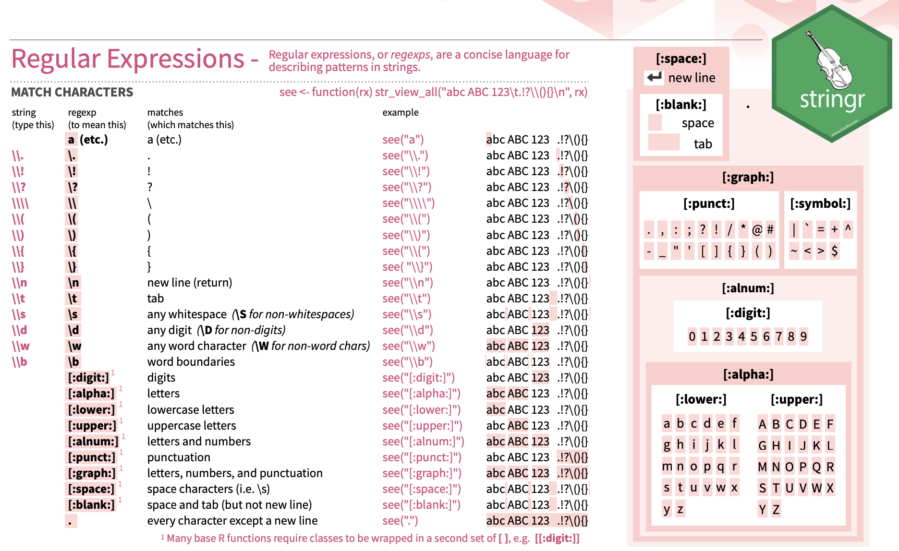

# Introduction

In this section, we will recap one of the most import data structures. We will also cover the basic idea of `regular expressions`, which is a very useful tool for describing patterns in strings.

The purpose of this recap course is to show how to work with a real dataset in R. 

The course is intended to be self-contained, but if you are new to R, we recommend that you go through our previous introduction to R:

[[https://lmsbioinformatics.github.io/LMS_Reproducible-R/]]


# Materials

* All prerequisites, links to material and slides for this course can be found on github - [LMS_Recap4R](https://lmsbioinformatics.github.io/LMS_Recap4R/)

* Or can be downloaded as a zip archive from here - [Download zip](https://github.com/LMSBioinformatics/LMS_Recap4R/archive/master.zip)

# Set the Working directory

Before running any of the code in the practicals or slides we need to set the working directory to the folder we unarchived. 

## Set working directory - in Rstudio

You can navigate to the unarchived LMS_Recap4R/course folder in the Rstudio menu

**Session -> Set Working Directory -> Choose Directory**

<div align="center">

</div>

## Set working directory - in the console

Use getwd() to see where your current directory is


```r
setwd("/PathToMyDownload/LMS_Recap4R/course")
# e.g. setwd("~/Downloads/LMS_PlottingInR/course")
```

# Data Credits

<center>

<div class="figure">

<p class="caption">GoT</p>
</div>

</center>

Ref: Lystad RP, Brown BT. "Death is certain, the time is not": mortality and survival in Game of Thrones. Inj Epidemiol. 2018 Dec 10;5(1):44. doi: 10.1186/s40621-018-0174-7. PMID: 30535868; PMCID: PMC6286904.

# A short intro to one of the most important data structures in R - **Data frame**


A data frame is a table  in which each column contains values of one variable and each row contains one set of values from each column. Both row and column names should be unique.  

* A data frame is produced when we upload a comma-delimited table into R using the _**read.csv()**_ command. 

* A useful command to check the content of a data frame is _**head()**_ which displays the top of the **data.frame**. 


```r
# reading in table 
episode_df <- read.csv("GoT_dataset/episode_data.csv")
# showing first 6 rows of the data frame
head(episode_df)
```

```
##   season episode_number                            episode_name
## 1      1              1                      "Winter Is Coming"
## 2      1              2                         "The Kingsroad"
## 3      1              3                             "Lord Snow"
## 4      1              4 "Cripples, Bastards, and Broken Things"
## 5      1              5                 "The Wolf and the Lion"
## 6      1              6                        "A Golden Crown"
##   gross_running_time opening_credits_time closing_credits_time net_running_time
## 1               3546                  110                   33             3403
## 2               3182                  111                   34             3037
## 3               3294                   96                   27             3171
## 4               3201                   96                   26             3079
## 5               3123                  101                   24             2998
## 6               3027                  103                   26             2898
##   cumulative_net_running_time
## 1                        3403
## 2                        6440
## 3                        9611
## 4                       12690
## 5                       15688
## 6                       18586
```

```r
# show last 6 rows of the data frome
tail(episode_df)
```

```
##    season episode_number                     episode_name gross_running_time
## 68      8             68                     "Winterfell"               3216
## 69      8             69 "A Knight of the Seven Kingdoms"               3334
## 70      8             70                 "The Long Night"               4875
## 71      8             71         "The Last of the Starks"               4686
## 72      8             72                      "The Bells"               4656
## 73      8             73                "The Iron Throne"               4711
##    opening_credits_time closing_credits_time net_running_time
## 68                  226                   78             2990
## 69                  108                   77             3149
## 70                  111                   84             4680
## 71                  114                   78             4430
## 72                  113                   77             4466
## 73                  119                   76             4516
##    cumulative_net_running_time
## 68                      209559
## 69                      212708
## 70                      217388
## 71                      221818
## 72                      226284
## 73                      230800
```

* use _dim()_ function to return the dimension of the **data.frame**


```r
dim(episode_df)
```

```
## [1] 73  8
```

* Another useful command to check the type of each columns from a data frame is _**str()**_ which compactly displays the structure of a R object. 


```r
# display the internal structure of an R object,
str(episode_df)
```

```
## 'data.frame':	73 obs. of  8 variables:
##  $ season                     : int  1 1 1 1 1 1 1 1 1 1 ...
##  $ episode_number             : int  1 2 3 4 5 6 7 8 9 10 ...
##  $ episode_name               : chr  "\"Winter Is Coming\"" "\"The Kingsroad\"" "\"Lord Snow\"" "\"Cripples, Bastards, and Broken Things\"" ...
##  $ gross_running_time         : int  3546 3182 3294 3201 3123 3027 3325 3345 3238 3028 ...
##  $ opening_credits_time       : int  110 111 96 96 101 103 105 105 116 116 ...
##  $ closing_credits_time       : int  33 34 27 26 24 26 26 28 32 32 ...
##  $ net_running_time           : int  3403 3037 3171 3079 2998 2898 3194 3212 3090 2880 ...
##  $ cumulative_net_running_time: int  3403 6440 9611 12690 15688 18586 21780 24992 28082 30962 ...
```

* use _as.factor()_ function to change data type to factor


```r
# change the data type for episode_df$season
episode_df$season <- as.factor(episode_df$season)
```

* use _unique()_ function to return a vector with duplicate elements removed


```r
# how many seasons are there
unique(episode_df$season)
```

```
## [1] 1 2 3 4 5 6 7 8
## Levels: 1 2 3 4 5 6 7 8
```

* use _table()_ function to see the counts at each combination of factor levels


```r
# show how many episodes for each seasons
table(episode_df$season)
```

```
## 
##  1  2  3  4  5  6  7  8 
## 10 10 10 10 10 10  7  6
```


## Subsetting data.frame

* using **[]** to subset data

* There are two ways of Subsetting Data in R, supplying a index vector or supplying a logical vector.

* subset the data frame based on columns

  + Single columns can either be accessed via the _**$**_ operator, writing the explicit name _**[,name]**_ (if the column has a name) or more generally by _**[,j]**_ for the **jth** column. 


```r
# different options to access the data 
head(episode_df$episode_name)
```

```
## [1] "\"Winter Is Coming\""                     
## [2] "\"The Kingsroad\""                        
## [3] "\"Lord Snow\""                            
## [4] "\"Cripples, Bastards, and Broken Things\""
## [5] "\"The Wolf and the Lion\""                
## [6] "\"A Golden Crown\""
```

```r
head(episode_df[,"episode_name"])
```

```
## [1] "\"Winter Is Coming\""                     
## [2] "\"The Kingsroad\""                        
## [3] "\"Lord Snow\""                            
## [4] "\"Cripples, Bastards, and Broken Things\""
## [5] "\"The Wolf and the Lion\""                
## [6] "\"A Golden Crown\""
```

```r
head(episode_df[,3])
```

```
## [1] "\"Winter Is Coming\""                     
## [2] "\"The Kingsroad\""                        
## [3] "\"Lord Snow\""                            
## [4] "\"Cripples, Bastards, and Broken Things\""
## [5] "\"The Wolf and the Lion\""                
## [6] "\"A Golden Crown\""
```

  + supply a logical vector:  If we are going to subset the data frame and only keep the following columns: c("season","episode_number","episode_name")


```r
col2keep <- c("season","episode_number","episode_name")

colnames(episode_df)
```

```
## [1] "season"                      "episode_number"             
## [3] "episode_name"                "gross_running_time"         
## [5] "opening_credits_time"        "closing_credits_time"       
## [7] "net_running_time"            "cumulative_net_running_time"
```

```r
keepVec <- colnames(episode_df) %in% col2keep

keepVec
```

```
## [1]  TRUE  TRUE  TRUE FALSE FALSE FALSE FALSE FALSE
```

```r
episode_df_Slim <- episode_df[,keepVec]

head(episode_df_Slim)
```

```
##   season episode_number                            episode_name
## 1      1              1                      "Winter Is Coming"
## 2      1              2                         "The Kingsroad"
## 3      1              3                             "Lord Snow"
## 4      1              4 "Cripples, Bastards, and Broken Things"
## 5      1              5                 "The Wolf and the Lion"
## 6      1              6                        "A Golden Crown"
```

  + supply an index vector:  If we are going to subset the data frame and only keep the following columns: c("season","episode_number","episode_name")


```r
col2keep <- c("season","episode_number","episode_name")

colnames(episode_df)
```

```
## [1] "season"                      "episode_number"             
## [3] "episode_name"                "gross_running_time"         
## [5] "opening_credits_time"        "closing_credits_time"       
## [7] "net_running_time"            "cumulative_net_running_time"
```

```r
# use which() function
keepInx <- which(colnames(episode_df) %in% col2keep) 

keepInx
```

```
## [1] 1 2 3
```

```r
episode_df_SlimInx <- episode_df[,keepInx]

head(episode_df_SlimInx)
```

```
##   season episode_number                            episode_name
## 1      1              1                      "Winter Is Coming"
## 2      1              2                         "The Kingsroad"
## 3      1              3                             "Lord Snow"
## 4      1              4 "Cripples, Bastards, and Broken Things"
## 5      1              5                 "The Wolf and the Lion"
## 6      1              6                        "A Golden Crown"
```


# Exercise I

* [Recap in R exercise 1](exercise/RecapR_Exercise1.html)


# Solutions I

* [Recap in R solution 1](exercise/RecapR_answer1.html)


# Regular expressions

* The use of `regular expressions` to manipulate data is a very useful tool, which can be applied in R, perl, Python and much more. More details about `regular expressions` [[https://en.wikipedia.org/wiki/Regular_expression]]

<center>

<div class="figure">

<p class="caption">Regular Expression</p>
</div>

</center>

* we use _sub()_ function and _gsub()_ function to help us understand how `regular expressions` work in R.

* _sub()_ and _gsub()_ perform replacement of the first and all matches respective


```r
oriString <- "Winter Is Coming"

newString1 <- sub(" ",".",oriString)
newString1
```

```
## [1] "Winter.Is Coming"
```

```r
newString2 <- gsub(" ",".",oriString)
newString2
```

```
## [1] "Winter.Is.Coming"
```

```r
# use regular expression

gsub("\\s",".",oriString)
```

```
## [1] "Winter.Is.Coming"
```

* replace all of the spaces in the `episode_df_Slim$episode_name` with `.`


```r
episode_df_Slim$new_episode_name <- gsub("\\s",".",episode_df_Slim$episode_name)
head(episode_df_Slim)
```

```
##   season episode_number                            episode_name
## 1      1              1                      "Winter Is Coming"
## 2      1              2                         "The Kingsroad"
## 3      1              3                             "Lord Snow"
## 4      1              4 "Cripples, Bastards, and Broken Things"
## 5      1              5                 "The Wolf and the Lion"
## 6      1              6                        "A Golden Crown"
##                          new_episode_name
## 1                      "Winter.Is.Coming"
## 2                         "The.Kingsroad"
## 3                             "Lord.Snow"
## 4 "Cripples,.Bastards,.and.Broken.Things"
## 5                 "The.Wolf.and.the.Lion"
## 6                        "A.Golden.Crown"
```


* we use _grep()_ function and _grepl()_ function to help us understand how `regular expressions` work in R. For example, we are going to add a new column `Contain.Dragon` to the episode_df_Slim. If the `episode_name` column contains "Dragon", `Contain.Dragon` == "TRUE", otherwise `Contain.Dragon` == "FALSE"


```r
# return logical vector
Logical_dragon <- grepl("Dragon",episode_df_Slim$episode_name)
Logical_dragon
```

```
##  [1] FALSE FALSE FALSE FALSE FALSE FALSE FALSE FALSE FALSE FALSE FALSE FALSE
## [13] FALSE FALSE FALSE FALSE FALSE FALSE FALSE FALSE FALSE FALSE FALSE FALSE
## [25] FALSE FALSE FALSE FALSE FALSE FALSE FALSE FALSE FALSE FALSE FALSE FALSE
## [37] FALSE FALSE FALSE FALSE FALSE FALSE FALSE FALSE FALSE FALSE FALSE FALSE
## [49]  TRUE FALSE FALSE FALSE FALSE FALSE FALSE FALSE FALSE FALSE FALSE FALSE
## [61]  TRUE FALSE FALSE FALSE FALSE FALSE  TRUE FALSE FALSE FALSE FALSE FALSE
## [73] FALSE
```

```r
# return indices
Inx_dragon <- grep("Dragon",episode_df_Slim$episode_name)
Inx_dragon
```

```
## [1] 49 61 67
```

```r
episode_df_Slim$Contain.Dragon <- Logical_dragon

# further subset the episode_df_Slim and only keep rows with "Dragon" in the episode_df_Slim$episode_name

## option 1 - using logical vector
episode_df_Slim_Dragon1 <-  episode_df_Slim[episode_df_Slim$Contain.Dragon=="TRUE",]
episode_df_Slim_Dragon1
```

```
##    season episode_number              episode_name          new_episode_name
## 49      5             49    "The Dance of Dragons"    "The.Dance.of.Dragons"
## 61      7             61             "Dragonstone"             "Dragonstone"
## 67      7             67 "The Dragon and the Wolf" "The.Dragon.and.the.Wolf"
##    Contain.Dragon
## 49           TRUE
## 61           TRUE
## 67           TRUE
```

```r
## option 2 - using indices
episode_df_Slim_Dragon2 <- episode_df_Slim[Inx_dragon,]
episode_df_Slim_Dragon2
```

```
##    season episode_number              episode_name          new_episode_name
## 49      5             49    "The Dance of Dragons"    "The.Dance.of.Dragons"
## 61      7             61             "Dragonstone"             "Dragonstone"
## 67      7             67 "The Dragon and the Wolf" "The.Dragon.and.the.Wolf"
##    Contain.Dragon
## 49           TRUE
## 61           TRUE
## 67           TRUE
```


* we use _sub()_ function again to help us understand how `regular expressions` work in R. In episode_df_Slim_Dragon1$episode_name, replace "Dragon" with "Dolphin" but keep "Dragonstone"


```r
# In episode_df_Slim_Dragon1$episode_name, replace "Dragon" with "Dolphin" but keep "Dragonstone"
episode_df_Slim_Dragon1$newEpiName <- sub("\\sDragon"," Dolphin",
                                          episode_df_Slim_Dragon1$episode_name)
episode_df_Slim_Dragon1
```

```
##    season episode_number              episode_name          new_episode_name
## 49      5             49    "The Dance of Dragons"    "The.Dance.of.Dragons"
## 61      7             61             "Dragonstone"             "Dragonstone"
## 67      7             67 "The Dragon and the Wolf" "The.Dragon.and.the.Wolf"
##    Contain.Dragon                 newEpiName
## 49           TRUE    "The Dance of Dolphins"
## 61           TRUE              "Dragonstone"
## 67           TRUE "The Dolphin and the Wolf"
```

```r
episode_df_Slim_Dragon1$newEpiName2 <- sub("(\\s)(Dragon)","\\1Dolphin",
                                           episode_df_Slim_Dragon1$episode_name)
episode_df_Slim_Dragon1
```

```
##    season episode_number              episode_name          new_episode_name
## 49      5             49    "The Dance of Dragons"    "The.Dance.of.Dragons"
## 61      7             61             "Dragonstone"             "Dragonstone"
## 67      7             67 "The Dragon and the Wolf" "The.Dragon.and.the.Wolf"
##    Contain.Dragon                 newEpiName                newEpiName2
## 49           TRUE    "The Dance of Dolphins"    "The Dance of Dolphins"
## 61           TRUE              "Dragonstone"              "Dragonstone"
## 67           TRUE "The Dolphin and the Wolf" "The Dolphin and the Wolf"
```

# Exercise II

* [Recap in R exercise 2](exercise/RecapR_Exercise2.html)


# Solutions II

* [Recap in R solution 2](exercise/RecapR_answer2.html)


# Resources

  + cheatsheet
  
      https://www.rstudio.com/resources/cheatsheets/
      
        + RStudio Cheatsheets
        
        + String manipulation with stringr cheatsheet


# sessionInfo


```r
sessionInfo()
```

```
## R version 4.1.2 (2021-11-01)
## Platform: x86_64-apple-darwin17.0 (64-bit)
## Running under: macOS Catalina 10.15.7
## 
## Matrix products: default
## BLAS:   /Library/Frameworks/R.framework/Versions/4.1/Resources/lib/libRblas.0.dylib
## LAPACK: /Library/Frameworks/R.framework/Versions/4.1/Resources/lib/libRlapack.dylib
## 
## locale:
## [1] en_GB.UTF-8/en_GB.UTF-8/en_GB.UTF-8/C/en_GB.UTF-8/en_GB.UTF-8
## 
## attached base packages:
## [1] stats     graphics  grDevices utils     datasets  methods   base     
## 
## loaded via a namespace (and not attached):
##  [1] digest_0.6.29   R6_2.5.1        jsonlite_1.7.3  magrittr_2.0.1 
##  [5] evaluate_0.14   highr_0.9       rlang_0.4.12    stringi_1.7.6  
##  [9] jquerylib_0.1.4 bslib_0.3.1     rmarkdown_2.11  tools_4.1.2    
## [13] stringr_1.4.0   xfun_0.28       yaml_2.2.2      fastmap_1.1.0  
## [17] compiler_4.1.2  htmltools_0.5.2 knitr_1.36      sass_0.4.0
```
